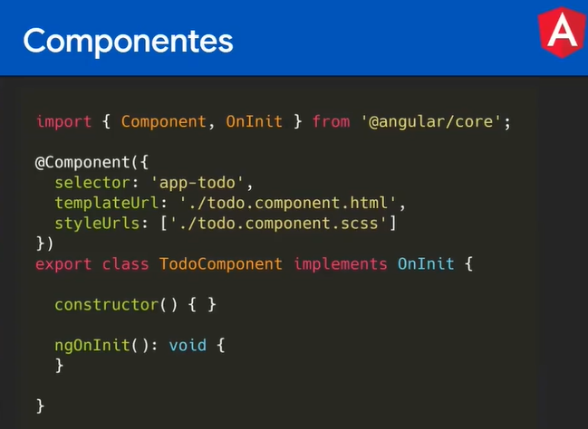
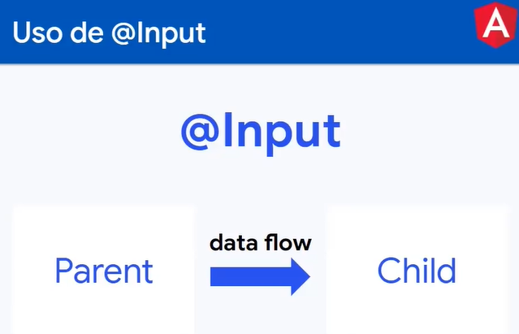
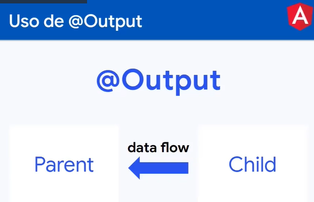
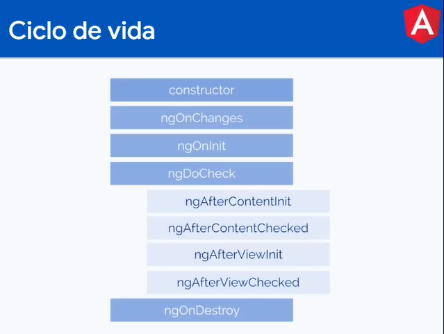
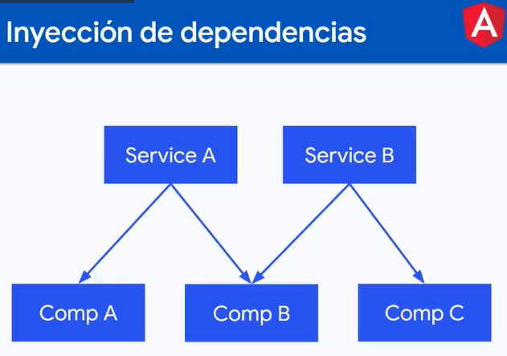
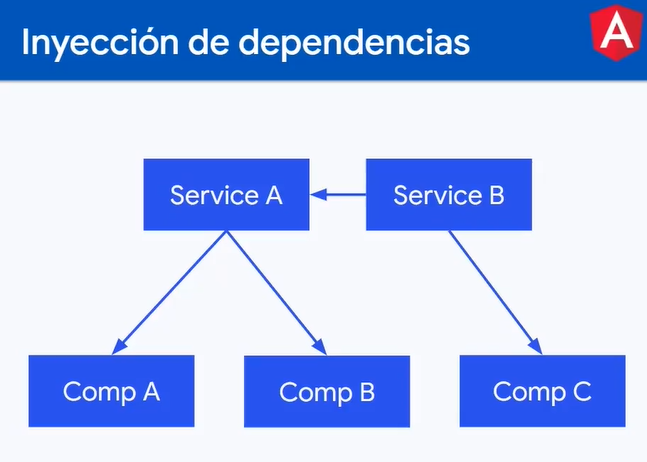
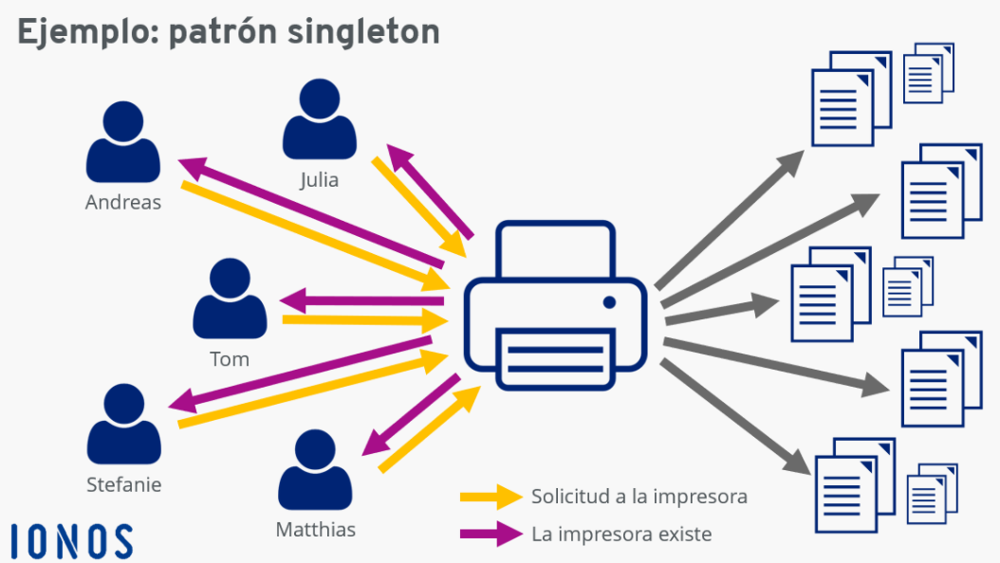
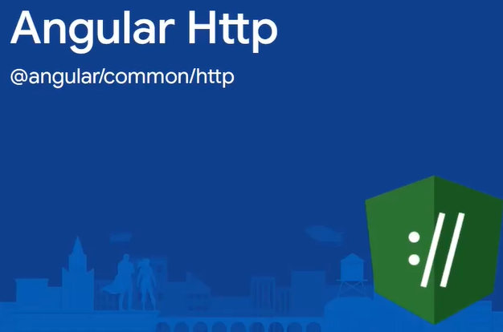

#### ¿QUÉ SON LOS COMPONENTES?

Un componente tiene responsabilidades unicas, estructura propia con estilos apropiados.

Componentes generado tiene los siguientes archivos:
-> todo.component.html
-> todo.component.css
-> todo.component.spec.ts (pruebas en angular)
-> todo.component.ts

Generar componentes
- ng g c [nombre del componente]

Crear componente sin estilos
- ng g c componentes/name_component -is

Crear componente sin archivos de testing
- ng g c componentes/img --skip-tests



#### @input

Se usa el decorador @Input para enviarle información desde el componente padre hasta el componente hijo. De manera que en nuestro componente hijo tendremos que declarar la variable que queremos recibir desde el padre declarando esta de la siguiente manera:
```
@input() nombreVariable:string;
```

#### @Output

El decorador @Output nos permite enviar información desde el componente hijo en dirección al componente padre por medio de un Event Emitter, para declarar un output lo hacemos de la siguiente manera:
```
@Output miOutput = new EventEmitter();
```

#### Ciclo de vida de los componentes


Ciclo :

- Constructor: cuando se corre una instancia
- ngOnChanges : corre antes y durante en el render, siempre que detecte cambios en el Input, está para eso, para detectar los cambios.
- ngOnInit: corre antes pero tiene la condicione que solo correo una vez. Ahi se corren eventos asincronos.
- ngAfcterViewInit: corre cuando los hijos de ese componentes se han renderizado.
- NgOnDestroy: Corre cuando se elimina el componente.

#### Servicios
Es la forma en la que Angular nos permite hacer modular el proyecto y aislar la lógica de negocio en archivos separados.
Los services tienne decodadores y le dicen a angular como debe de coportarse esa clase y hace que se pueda inyectar en otros componentes y servicios.
```
ng g s [nombre del servicio] 
```
  
###### Inyección de dependencias


Inyección de Dependencias (Dependency Injection o DI) es un patrón de diseño en el que una clase requiere instancias de una o más clases y en vez de generarlas dentro de su propio constructor, las recibe ya instanciadas por un mecanismo externo.

Los servicios pueden inyectar otros servicios




###### Patrón singleton
El propósito de este patrón es evitar que sea creado más de un objeto por clase. Esto se logra creando el objeto deseado en una clase y recuperándolo como una instancia estática. El singleton es uno de los patrones más simples, pero más poderosos en el desarrollo de software.



###### Obteniendo datos de una API
Hay un módulo que nos ofrece Angular de forma nativa para manejar los llamados http. Con éste módulo se puede hacer todas las operaciones http (get, post, put/patch, delete).



En el servicio:
1- crear el servicio desde la terminal
2- importar el modulo HttpCliente en el servcio e inyectar e servicio en el constructor.
3 en el servicio se crea el metodo para hace la petición de la API:
return this.http.get<Product[]>(‘https://fakestoreapi.com/products’);

En el componente:
1- importar el servicio
2- inyectar el servicio en el constructor: private productsService: ProductsService
3- crear el metodo en el ngOnInit
this.productsService.getAllProducts()
.subscribe(data => {
this.products = data;

Por ultimo ya estaba creado un array tipado y se debe ajustar los campos con los campos de la API.


#### Pipes (tuberías)
Los pipes son una herramienta de Angular que nos permite transformar visualmente la información, por ejemplo, cambiar un texto a mayúsculas o minúsculas, o darle formato de fecha y hora, formatos numéricos. El valor de la información transformada no cambia, sólo lo hace su aspecto.

Para más información acerca de los pipes puedes ir al [siguiente enlace](https://aristotekean.medium.com/tipos-de-pipes-en-angular-d736079491b1).

sintaxis:
```
<p> {{ variable | nombreDelPipe }} </p>
```

###### Crear tus propios pipes
```
ng g p [nombre del pipe]
```
Dentro del archivo generado debes de retornar qué es lo que vas a transformar, dependiendo de la entrada


#### Directivas
Las directivas se usan para modificar el DOM de forma directa y también se pueden modificar los atributos.

```
ng g d [nombre de la directiva]
```

#### Buenas prácticas con Angular
En el siguiente [enlace](https://angular.io/guide/styleguide#naming) puedes encontrar la guía oficial de Angular para aplicar una serie de buenas prácticas a todo proyecto Angular.

Así mismo se pueden activar estas buenas prácticas con el linter e integrarlo a vsCode de la siguiente forma:
1. Configurando un linter:
```
ng add @angular-eslint/schematics
```
2. Implementar el linter
```
ng lint
```
